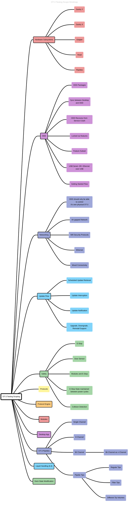

# ot3-testing
Location for all testing documentation for OT-3
 
## Mindmap

```mermaid
---
title: OT-3 Testing Scope Mindmap
---

%%{init: {'theme': 'dark', 'startOnLoad': 'true', 'securityLevel': 'loose', 'flowchart': {'nodeSpacing': 80, 'rankSpacing': 100, 'curve': 'basis', 'htmlLabels': false}}}%%

flowchart LR

%%--Styling Definitions-------------------------%%
classDef RedFill fill:#EF9A9A;
classDef PurpleFill fill:#CE93D8;
classDef IndigoFill fill:#9FA8DA;
classDef LightBlueFill fill:#81D4FA;
classDef GreenFill fill:#A5D6A7;
classDef YellowFill fill:#FFF59D;
classDef OrangeFill fill:#FFCC80;
classDef WhiteFill fill:#FFF;

classDef DarkText color: black;

classDef NoOutline stroke: none;
classDef DarkOutline stroke: black,stroke-width:3px;
classDef HeavyDarkOutline stroke: black,stroke-width:6px;

linkStyle default stroke:#000,stroke-width:4px,color:black;


%%--Node Definitions----------------------------%%
    root("OT-3 Testing Scoping")

    class root WhiteFill;
    class root HeavyDarkOutline;

    %%--Hardware Subsystems---------------------%%
    hardware_subsystems("Hardware Subsystems")

    gantry_y("Gantry Y")
    gantry_x("Gantry X")
    gripper("Gripper")
    head("Head")
    pipettes("Pipettes")
    class hardware_subsystems,gantry_y,gantry_x,gripper,head,pipettes RedFill;


    %%--ODD-------------------------------------%%
    %% What are the dependencies of the ODD app on the local filesystem?
    %% For example, where do it's logs live
    %% Add feature flag for putting ODD into dev mode

    odd("ODD")

    odd_packages("ODD Packages")
    sync("Sync between Desktop\nand ODD")
    odd_recovery("ODD Recovery from Service Crash")
    locked_out_features("Locked out features")
    feature_subset("Feature Subset")
    usb_serial("USB Serial -OR- Ethernet over USB")
    getting_started_flow("Getting Started Flow")

    class odd,odd_packages,sync,odd_recovery,locked_out_features,feature_subset,usb_serial,getting_started_flow PurpleFill;


    %%--Networking------------------------------%%
    networking("Networking")

    odd_access("ODD should only be able to control\nit's own physical OT-3")
    air_gapped("Air-gapped Network")

    %% Open-network, WPA2, 802.1x, Hidden SSID
    wifi_security_protocols("Wifi Security Protocols")
    ethernet("Ethernet")

    %% Different combinations of Wifi, Ethernet, & USB
    mixed_connectivity("Mixed Connectivity")

    class networking,odd_access,air_gapped,wifi_security_protocols,ethernet,mixed_connectivity IndigoFill;


    %%--Update Flow-----------------------------%%
    update_flow("Update Flow")

    scheduled_update_retrieval("Scheduled Update Retrieval")
    update_interruption("Update Interruption")

    %% Single file covers App, Robot Server, ODD, & Firmware. All the things
    update_notification("Update Notification")

    upgrade_downgrade_reinstall("Upgrade, Downgrade, Reinstall Support")

    class update_flow,scheduled_update_retrieval,update_interruption,update_notification,upgrade_downgrade_reinstall LightBlueFill;


    %%--Safety----------------------------------%%
    safety("Safety")

    e_stop("E-Stop")
    door_sensor("Door Sensor")
    modules_and_e_stop("Modules and E-Stop")
    e_stop_state_maintained("E-Stop State maintained between power cycles")
    collision_detection("Collision Detection")

    class safety,e_stop,door_sensor,modules_and_e_stop,e_stop_state_maintained,collision_detection GreenFill;


    %%--Protocols-------------------------------%%
    protocols("Protocols")

    class protocols YellowFill;


    %%--Protocol Engine-------------------------%%
    protocol_engine("Protocol Engine")

    class protocol_engine OrangeFill;


    %%--Modules---------------------------------%%
    modules("Modules")

    class modules RedFill;


    %%--Desktop App-----------------------------%%
    desktop_app("Desktop App")

    class desktop_app PurpleFill;


    %%--OT-3 Pipettes---------------------------%%
    ot3_pipettes("OT-3 Pipettes")

    single_channel("Single Channel")
    8_channel("8 Channel")
    96_channel("96 Channel")
    96_channel_as_n_channel("96-Channel as n-Channel")

    tips("Pipette Tips")
    regular("Regular Tips")
    filter_tips("Filter Tips")
    different_tip_volumes("Different Tip Volumes")

    class ot3_pipettes,single_channel,8_channel,96_channel,96_channel_as_n_channel,tips,regular,filter_tips,different_tip_volumes IndigoFill;


    %%--Liquid Handling-------------------------%%
    liquid_handling("Liquid Handling (6.3)")

    class liquid_handling LightBlueFill;


    %%--Deck State Modification-----------------%%
    deck_state_mod("Deck State Modification")

    class deck_state_mod GreenFill;

%%--Connections---------------------------------%%
root --- hardware_subsystems & odd & networking & update_flow & safety
root --- modules & protocols & desktop_app & ot3_pipettes & liquid_handling
root --- deck_state_mod & protocol_engine

hardware_subsystems --- head & gantry_x & gantry_y & gripper & pipettes
odd --- odd_packages & sync & odd_recovery & locked_out_features & feature_subset & usb_serial & getting_started_flow
networking --- odd_access & air_gapped & wifi_security_protocols & ethernet & mixed_connectivity
update_flow --- scheduled_update_retrieval & update_interruption & update_notification & upgrade_downgrade_reinstall
safety --- e_stop & door_sensor & modules_and_e_stop & e_stop_state_maintained & collision_detection

ot3_pipettes --- single_channel & 8_channel & 96_channel & tips
96_channel --- 96_channel_as_n_channel
tips --- regular & filter_tips & different_tip_volumes


%%--General Class Assignment--------------------%%

%% Dark Text
class root,hardware_subsystems,gantry_y,gantry_x,gripper,head,pipettes,odd,odd_packages,sync,odd_recovery,locked_out_features,feature_subset,networking,odd_access,air_gapped,update_flow,scheduled_update_retrieval,update_interruption,update_notification,e_stop,door_sensor,modules_and_e_stop,safety,e_stop_state_maintained,usb_serial,getting_started_flow,wifi_security_protocols,ethernet,mixed_connectivity,upgrade_downgrade_reinstall,collision_detection,protocols,protocols,protocol_engine,modules,desktop_app,ot3_pipettes,deck_state_mod,single_channel,8_channel,96_channel,96_channel_as_n_channel,tips,regular,filter_tips,different_tip_volumes,liquid_handling DarkText;

%% Dark Outline
class hardware_subsystems,odd,networking,update_flow,safety,protocols,protocol_engine,modules,desktop_app,ot3_pipettes,deck_state_mod,liquid_handling DarkOutline;

%% No Outline
class gantry_y,gantry_x,gripper,head,pipettes,odd_access,air_gapped,scheduled_update_retrieval,update_interruption,update_notification,odd_packages,sync,odd_recovery,locked_out_features,feature_subset,e_stop,door_sensor,modules_and_e_stop,e_stop_state_maintained,wifi_security_protocols,ethernet,mixed_connectivity,upgrade_downgrade_reinstall,collision_detection,usb_serial,getting_started_flow,protocols,single_channel,8_channel,96_channel,96_channel_as_n_channel,tips,regular,filter_tips,different_tip_volumes NoOutline;

```
