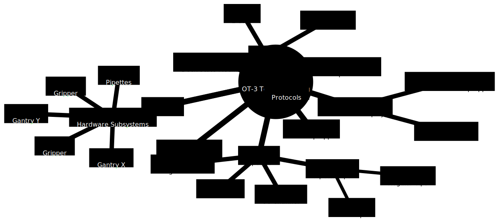

# ot3-testing
Location for all testing documentation for OT-3

When you update `mermaid/mindmap.mmd` run `generate_mindmap.sh` and commit
`images/mindmap.svg`

The mindmap mermaid diagram type is still experimental so it doesn't
render very nicely.

## Mindmap

